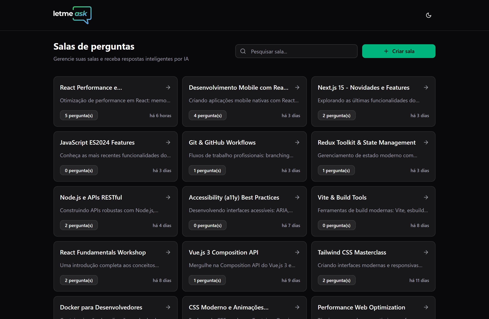
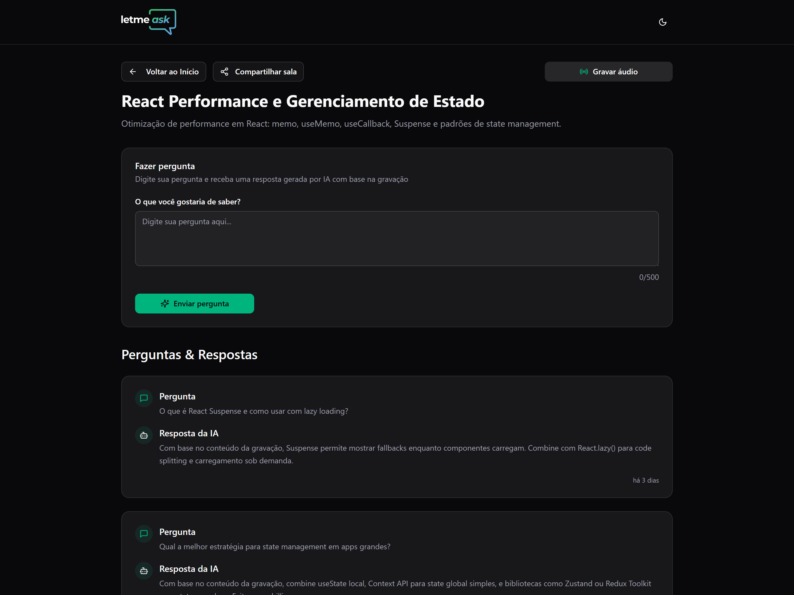
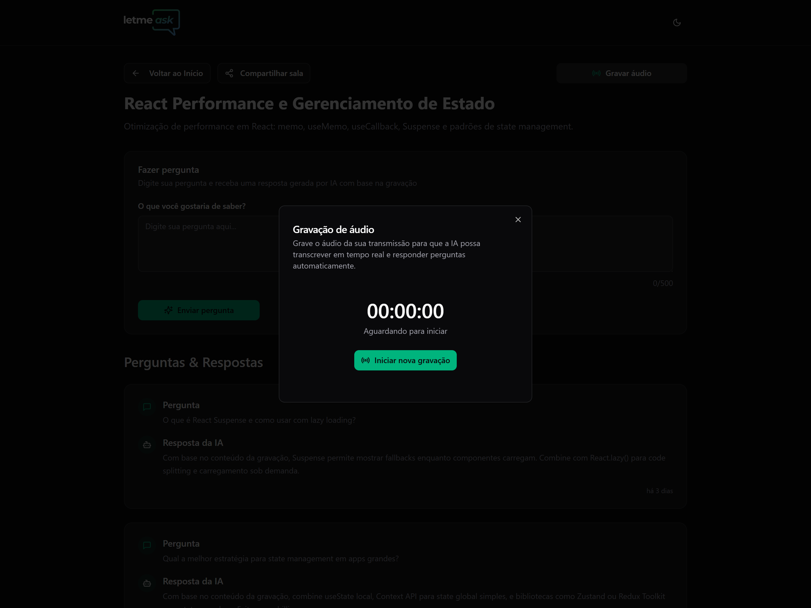
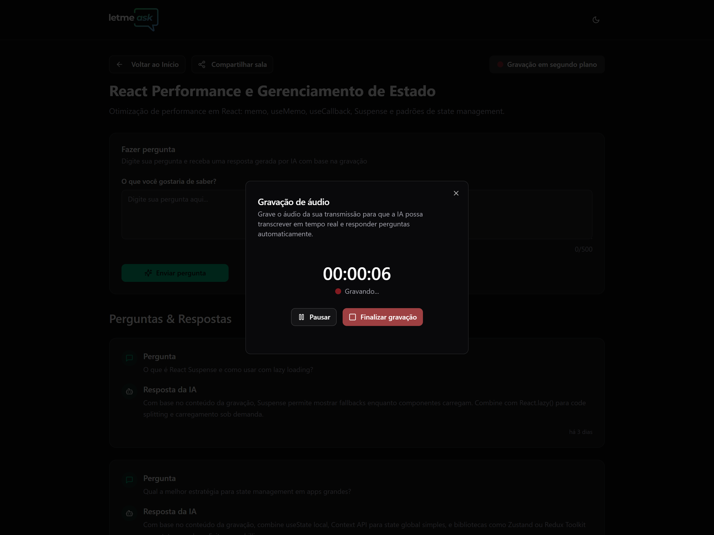

<div align="center">


<br/>
<br/>

</div>
<div align="center">
   <a href="https://github.com/mathrb22">
      
   </a>
   <a href="https://github.com/mathrb22/let-me-ask-web/commits/main">
      
   </a>
   <a href="https://github.com/mathrb22/let-me-ask-web/issues">
      
   </a>
   <a href="https://github.com/mathrb22/let-me-ask-web/pulls">
      
   </a>
   <a href="https://github.com/mathrb22/let-me-ask-web/blob/main/LICENSE">
      
   </a>
</div>

</br>
<div align="center">

[**Sobre**](#-sobre) &nbsp;&nbsp;**|**&nbsp;&nbsp;
[**Objetivo**](#-objetivo) &nbsp;&nbsp;**|**&nbsp;&nbsp;
[**Tecnologias e ferramentas**](#-tecnologias-e-ferramentas) &nbsp;&nbsp;**|**&nbsp;&nbsp;
[**Features**](#-features) &nbsp;&nbsp;**|**&nbsp;&nbsp;
[**Instalação e execução**](#-instalação-e-execução) &nbsp;&nbsp;**|**&nbsp;&nbsp;
[**Integração com o Backend**](#-integração-com-o-backend) &nbsp;&nbsp;**|**&nbsp;&nbsp;
[**Como contribuir**](#-como-contribuir) &nbsp;&nbsp;**|**&nbsp;&nbsp;
[**Licença**](#-licença)

</div>

## 📃 Sobre

 </br>

Este repositório contém o código-fonte do **frontend** do projeto **Let me ask**, desenvolvido durante a **NLW Agents (Next Level Week)** da [**Rocketseat**](https://github.com/Rocketseat).

Este projeto integra a **API do Google Gemini**, **busca semântica** e **processamento de dados vetoriais** para fornecer respostas automáticas às perguntas dos participantes durante transmissões ao vivo. O sistema funciona da seguinte forma: com base na transcrição em tempo real da apresentação, a IA processa e armazena vetores semânticos dos assuntos abordados. Quando um usuário faz uma pergunta na sala, o sistema utiliza busca semântica para verificar se essa questão já foi respondida pelo apresentador na transcrição e, caso positivo, fornece automaticamente a resposta contextualizada.

 </br>

## 🎯 Objetivo

O objetivo principal do **Let me ask** é de criar uma solução inteligente para transmissões ao vivo, onde perguntas dos participantes serão respondidas automaticamente através de inteligência artificial. O sistema utiliza:

- **Transcrição em tempo real** de transmissões ao vivo
- **Processamento de dados vetoriais** para armazenar contexto semântico
- **Busca semântica** para identificar se perguntas já foram respondidas

A aplicação foi desenvolvida com o intuito de aprimorar os conhecimentos em React, Vite, TypeScript, Tailwind CSS, React Query e React Router, além de integrar tecnologias modernas de IA e processamento de linguagem natural.

## 🚀 Tecnologias e ferramentas

<table>
  <tr>
    <td align="center" width="100">
      <a href="https://reactjs.org/" target="_blank" rel="noopener noreferrer">
      
      </a>
    </td>
    <td align="center" width="100">
      <a href="https://vitejs.dev/">
      
      </a>
    </td>
    <td align="center" width="100">
      <a href="https://www.typescriptlang.org/">
      
      </a>
    </td>
    <td align="center" width="120">
      <a href="https://tailwindcss.com" target="_blank" rel="noopener noreferrer">
      
      </a>
    </td>
    <td align="center" width="100">
      <a href="https://tanstack.com/query" target="_blank" rel="noopener noreferrer">
      
      </a>
    </td>
    <td align="center" width="140">
      <a href="https://reactrouter.com/" target="_blank" rel="noopener noreferrer">
      
      </a>
    </td>
    <td align="center" width="140">
      <a href="https://lucide.dev/" target="_blank" rel="noopener noreferrer">
      
      </a>
    </td>
    <td align="center" width="140">
      <a href="https://ui.shadcn.com/" target="_blank" rel="noopener noreferrer">
      
      </a>
    </td>
    </tr>
    <tr>
    <td align="center"><a href="https://reactjs.org/" target="_blank" rel="noopener noreferrer"><span>React</span></a></td>
    <td align="center"><a href="https://vitejs.dev/" target="_blank" rel="noopener noreferrer"><span>Vite</span></a></td>
    <td align="center"><a href="https://www.typescriptlang.org/" target="_blank" rel="noopener noreferrer"><span>TypeScript</span></a></td>
    <td align="center"><a href="https://tailwindcss.com" target="_blank" rel="noopener noreferrer"><span>Tailwind CSS</span></a></td>
    <td align="center"><a href="https://tanstack.com/query" target="_blank" rel="noopener noreferrer"><span>React Query</span></a></td>
    <td align="center"><a href="https://reactrouter.com/" target="_blank" rel="noopener noreferrer"><span>React Router</span></a></td>
    <td align="center"><a href="https://lucide.dev/" target="_blank" rel="noopener noreferrer"><span>Lucide React</span></a></td>
    <td align="center"><a href="https://ui.shadcn.com/" target="_blank" rel="noopener noreferrer"><span>shadcn/ui</span></a></td>
    </tr>
</table>

## ✨ Features

### 🏠 **Sistema de Salas**

✅ **Criação e listagem de salas:** interface para criação, navegação e listagem de salas disponíveis via API.<br/>

### ❓ **Sistema de Perguntas**

✅ **Formulário intuitivo:** interface para envio de perguntas com validação avançada e contador de caracteres.<br/>
✅ **Perguntas e respostas:** exibição organizada de perguntas com respostas geradas por IA em tempo real.<br/>
✅ **Feedback visual:** indicadores de status durante a geração de respostas pela IA.<br/>

### 🎙️ **Gravação de Áudio Inteligente**

✅ **Modal de gravação:** interface simplificada em modal para gravação de áudio, substituindo a página dedicada.<br/>
✅ **Controles avançados:** botões para iniciar, pausar, retomar e finalizar gravação com feedback visual.<br/>
✅ **Gravação em segundo plano:** possibilidade de gravar áudio enquanto visualiza as perguntas e respostas.<br/>
✅ **Timer em tempo real:** cronômetro exibindo o tempo de gravação no formato _HH:MM:SS_.<br/>
✅ **Upload automático:** captura e upload de áudio em tempo real com divisão em chunks de 10 segundos.<br/>



 </br>

### 🤖 **Integração com IA**

✅ **Respostas automáticas:** respostas contextualmente relevantes via **Google Gemini API**.<br/>
✅ **Transcrição em tempo real:** processamento de áudio para texto via backend.<br/>
✅ **Processamento vetorial:** armazenamento de vetores semânticos _(embeddings)_ para busca eficiente.<br/>
✅ **Busca semântica:** identificação inteligente de respostas já fornecidas anteriormente.<br/>

### 🎨 **Interface e Experiência do Usuário**

A aplicação conta com uma **interface moderna e responsiva**, incluindo:

✅ **Design responsivo:** interface adaptável para diferentes tamanhos de tela.<br/>
✅ **Estados de carregamento:** exibição de skeleton loading durante o carregamento das salas para melhor experiência do usuário.<br/>
✅ **Estados vazios:** componentes de No-content quando não há salas ou perguntas cadastradas <br/>
✅ **Gravação de áudio simplificada** através de modal integrado à página da sala com exibição de tempo de gravação e botões de controle de pausa, retomada e finalização<br/>
✅ **Tema claro/escuro** com alternância suave e persistência de preferência<br/>
✅ **Navegação otimizada** com header fixo e botão de rolagem automática para o topo da página<br/>

### 📱 **Melhorias Mobile e Responsividade**

✅ **Diálogos adaptáveis:** modais que se transformam em _bottom sheets_ no mobile para melhor usabilidade<br/>
✅ **FABs (Floating Action Buttons):** botões flutuantes para ações principais no mobile (criação de salas e perguntas)<br/>
✅ **Barra de status de gravação:** indicador fixo no mobile mostrando status da gravação em tempo real<br/>
✅ **Busca de salas:** campo de pesquisa com _debounce_ para filtrar salas<br/>

## 🔧 Instalação e execução

Para baixar o código-fonte do projeto em sua máquina, primeiramente terá que ter instalado o [**Git**](https://git-scm.com/).
Com o Git instalado, em seu terminal execute o seguinte comando:

```bash
git clone https://github.com/mathrb22/let-me-ask-web.git
```

Para instalar as dependências e executar o projeto terá que ter instalado em sua máquina o [**node.js**](https://nodejs.org/en/), que vem acompanhado do npm. Instale as dependências usando o comando abaixo:

```bash
npm install
```

Executar o projeto:

```bash
npm run dev
```

A aplicação estará disponível em http://localhost:5173. Você poderá acessá-la a partir do seu navegador.

## 🔗 Integração com o Backend

Esta aplicação frontend requer uma API backend para funcionar completamente. O servidor está configurado para rodar em `http://localhost:3333` e é **essencial** para o funcionamento das principais funcionalidades.

### 📦 Repositório do backend

O código-fonte do backend está disponível em um repositório separado:

🔗 **[Let me ask - Server (API)](https://github.com/mathrb22/let-me-ask-server)**

### ⚙️ Funcionalidades do backend

O backend é responsável por:

- 🏠 **Gerenciamento de salas**: criação, listagem e gerenciamento de salas de Q&A
- ❓ **Sistema de perguntas**: armazenamento e processamento de perguntas dos usuários
- 🎙️ **Processamento de áudio**: captura, processamento e transcrição de áudio em tempo real
- 🤖 **Integração com IA**: conexão com _Google Gemini API_ para geração de respostas
- 🔍 **Busca semântica**: algoritmo de busca vetorial para identificar contexto
- 📊 **Processamento vetorial**: geração e armazenamento de vetores semânticos _(embeddings)_

### 🚀 Como executar o backend

Para ter acesso completo às funcionalidades do sistema, é necessário configurar e executar o servidor backend.

📋 **Siga o guia completo de instalação e configuração:**

🔗 **[Instalação e execução da API](https://github.com/mathrb22/let-me-ask-server?tab=readme-ov-file#-instala%C3%A7%C3%A3o-e-execu%C3%A7%C3%A3o)**

## 💡 Como contribuir

- Faça um **_fork_** desse repositório;
- Crie um **branch** para a sua feature: `git checkout -b minha-feature`;
- Faça um **commit** com suas alterações: `git commit -m 'feat: Minha nova feature'`;
- Faça um **push** para o seu branch: `git push origin minha-feature`;
- Faça um **pull request** com sua feature;

Pull requests são sempre bem-vindos. Em caso de dúvidas ou sugestões, crie uma _**issue**_ ou entre em contato comigo.

## 📝 Licença

<a href="https://github.com/mathrb22/let-me-ask-web/blob/main/LICENSE">
    
</a>

Esse projeto está sob a licença **MIT**. Veja o arquivo _**LICENSE**_ para mais detalhes.

---

Desenvolvido com 💚 por <a href="https://github.com/mathrb22/">mathrb22</a>

<div style="display: flex;">
  <a href="https://www.linkedin.com/in/matheus-ribeiro-dev" target="_blank"></a>
  <a href="mailto:math.ribeiro.dev@gmail.com"></a>
</div>
